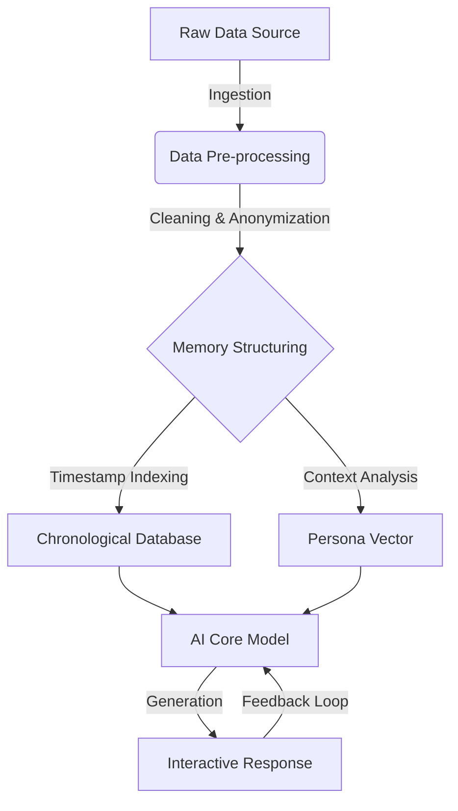

# Project Chimera Genesis: The Philosophical AI Companion
### *A Digital Synthesis of Memory & Persona*


> **"What if memories weren't just stored, but lived?"**

## 📖 Project Overview (ภาพรวมโครงการ)

**Chimera Genesis** is an experimental project exploring the boundaries between **Artificial Intelligence**, **Human Memory**, and **Interactive Storytelling**.

The goal is to create a **"Philosophical AI Companion"**—a digital entity synthesized from real-world conversation logs (`story.txt`) spanning over 3 years. Unlike generic chatbots, this AI is designed to possess specific memories, personality traits, and a unique philosophical worldview derived from its source data.

This project is not just about code; it is a study in **Digital Archaeology**—excavating the past to build a companion for the future.

---

## 🧠 Core Concept: The "BasAI" Architecture

The system is designed to process unstructured chat data into a structured "Memory Core" that drives the AI's personality.

### **Data Flow Architecture**

*(Imagine a diagram here: Raw Data -> Cleaning -> Memory Structuring -> AI Model -> Interaction)*



1.  **Input (Raw Data):**
    *   **Source:** `story.txt` (An archive of chat logs from 2021-Present).
    *   **Content:** Unstructured text, timestamps, emotional context, and multimedia references.

2.  **Process (The "Chimera" Engine):**
    *   **Data Cleaning:** Using Python (Pandas/Regex) to remove noise, system messages, and Anonymize sensitive PII (Personally Identifiable Information).
    *   **Structuring:** Organizing data into a chronological timeline to simulate "memory growth."
    *   **Persona Synthesis:** Extracting writing styles, vocabulary patterns, and core beliefs to shape the AI's "soul."

3.  **Output (The Experience):**
    *   A conversational agent that doesn't just answer queries but **"remembers"** shared experiences.
    *   Future Goal: Visualizing this entity through **Godot Engine** as an interactive 3D/2D Avatar.

---

## 🛠 Tech Stack & Tools

*   **Languages:** Python (Data Processing), GDScript (Future Visual Interface)
*   **Libraries:** Pandas, NLTK (Natural Language Processing), NumPy
*   **AI Models:** Google AI Studio (Gemini Pro) for prototyping logic & prompt engineering.
*   **Environment:** Termux (Mobile Development Environment), VS Code.

---

## 📂 Project Structure

```
Chimera-Genesis/
├── data/
│   ├── raw/                  # (Private) Original chat logs
│   └── processed/            # Structured JSON/CSV datasets (Anonymized)
├── src/
│   ├── cleaner.py            # Script for cleaning chat logs
│   ├── analyzer.py           # Sentiment & keyword analysis
│   └── memory_node.py        # Logic for linking related memories
├── docs/
│   ├── concept_art/          # Sketches of the AI avatar
│   └── architecture_v1.png   # System design diagrams
├── README.md                 # Project Documentation
└── requirements.txt          # Python dependencies
```

---

## 🚀 Current Progress & Roadmap

- [x] **Phase 1: Data Archaeology** (Completed)
    - [x] Collecting 3+ years of chat history.
    - [x] Initial data cleaning and format standardization.
- [ ] **Phase 2: Logic Implementation** (In Progress)
    - [ ] Developing the NLP pipeline to identify "Core Memories."
    - [ ] Connecting to LLM API for dynamic responses.
- [ ] **Phase 3: Visualization (The Multimedia Goal)** (Future)
    - [ ] Creating a Visual Interface using **Godot Engine**.
    - [ ] Implementing Text-to-Speech (TTS) for voice interaction.
    - [ ] **This phase is the primary motivation for my application to the Multimedia program at MSU.**

---

## ⚠️ Ethical & Privacy Statement

This project adheres to strict **Data Privacy** principles.
*   The raw dataset (`story.txt`) contains personal conversations and is **NEVER** uploaded publicly.
*   All data used for model training or demonstration is strictly **Anonymized**.
*   The project explores the *concept* of digital memory, respecting the consent and privacy of all individuals involved in the source data.

---

### 👨‍💻 Developer Note

*"I believe that in the future, Multimedia will not just be about what we see or hear, but who we interact with. Chimera Genesis is my first step into that future."*

**- Bas (Pongsagorn P.)**
